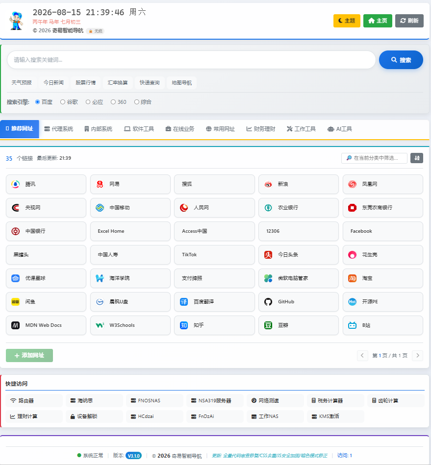

# 奇易智能导航系统（V3.1.2）

带**后台管理**与 **Docker 部署**的网址导航站。在原纯静态导航站基础上增加了：

- 🔧 **真正的后台管理**（`/admin.html`）：登录鉴权、链接增删改查、分类筛选、批量删除、导入/导出、改密码、一键重置。
- 🗄️ **服务端数据持久化**：链接数据保存在服务器 `data/links.json`，多设备/多浏览器共享，不再依赖 localStorage。
- 🐳 **Docker 一键部署**：零依赖 Node 后端（`http` + `crypto` 内置模块），镜像极小。
- 🔐 **安全加固**：管理密码服务端哈希校验，登录态用 `HttpOnly` + `SameSite` Cookie，前端 localStorage 假密码已被替换。
- ✅ **验证核对**：脚本统计分类数量、检测分类内/跨分类重复、校验 URL 合法性。

> 原站的所有功能（农历、问候语、搜索引擎、暗色模式、搜索建议等）全部保留。

> 产品说明： [PRODUCT.md](PRODUCT.md) ｜ 飞牛 FNOS 部署： [FNOS_DEPLOY.md](FNOS_DEPLOY.md) ｜ 发布说明： [RELEASE_NOTES.md](RELEASE_NOTES.md)

---

## 一、目录结构

```
hao123/
├── index.html          # 前台导航页
├── admin.html          # 后台管理页
├── css/
│   ├── style.css       # 前台样式
│   └── admin.css       # 后台样式
├── js/
│   ├── list.js         # 默认链接数据（前端回退用）
│   ├── api.js          # 后端 API 客户端
│   ├── script.js       # 前台主逻辑（已支持后端模式）
│   └── admin.js        # 后台逻辑
├── server.js           # 零依赖 Node 后端
├── package.json
├── scripts/
│   ├── seed.js         # 从 list.js 生成 data/seed.json
│   └── verify.js       # 验证核对脚本
├── data/               # 运行时数据（links.json / config.json / seed.json）
├── Dockerfile
├── docker-compose.yml
└── .env.example
```

---

## 二、本地直接运行（无需 Docker）

需要 Node.js >= 16。

```bash
# 1. 生成默认数据（首次）
node scripts/seed.js

# 2. 启动（默认端口 1315）
node server.js
#   或： npm start
```

打开：

- 前台： http://localhost:1315/
- 后台： http://localhost:1315/admin.html

默认管理员密码：`admin`（登录后请务必在后台「改密码」）。
可用环境变量覆盖：

```bash
PORT=9000 ADMIN_PASSWORD=你的密码 SESSION_SECRET=随机密钥 node server.js
```

---

## 三、Docker 部署

### 方式 A：docker-compose（推荐）

```bash
# 1. 按需修改 docker-compose.yml 中的 ADMIN_PASSWORD / SESSION_SECRET
docker compose up -d --build
```

访问 http://localhost:1315/ 与 http://localhost:1315/admin.html
数据持久化在宿主机的 `./data` 目录（已挂载为卷）。

### 方式 B：docker run

```bash
docker build -t qiyi-nav .
docker run -d --name qiyi-nav \
  -p 1315:1315 \
  -e ADMIN_PASSWORD=你的密码 \
  -e SESSION_SECRET=随机密钥 \
  -v $(pwd)/data:/app/data \
  --restart unless-stopped \
  qiyi-nav
```

---

## 四、后台管理说明

| 功能 | 说明 |
| --- | --- |
| 登录 | 输入管理密码，服务端写入 HttpOnly Cookie（7 天有效） |
| 新增/编辑 | 在任意分类下增改网址，支持颜色标记 |
| 删除/批量删除 | 表格勾选后批量删除 |
| 导入/导出 | JSON 全量备份与恢复 |
| 改密码 | 修改后原会话失效，需重新登录 |
| 重置默认 | 一键恢复系统默认链接数据 |

前台页面点「管理面板」按钮会跳转后台（需先验证密码）。

---

## 五、API 一览（同源）

| 方法 | 路径 | 鉴权 | 说明 |
| --- | --- | --- | --- |
| GET | `/api/links` | 否 | 获取全部链接 |
| PUT | `/api/links` | 是 | 全量保存链接 |
| POST | `/api/login` | 否 | 登录（写入 Cookie） |
| POST | `/api/logout` | 否 | 退出 |
| GET | `/api/me` | 否 | 返回登录状态 |
| GET | `/api/stats` | 是 | 分类统计 |
| POST | `/api/change-password` | 是 | 修改密码 |
| POST | `/api/import` | 是 | 导入数据 |
| GET | `/api/export` | 是 | 导出 JSON |
| POST | `/api/reset` | 是 | 重置为默认 |

---

## 六、验证核对

```bash
node scripts/verify.js
```

输出各分类链接数量、分类内/跨分类重复、URL 合法性，并生成 `VERIFY_REPORT.txt`。
生成 seed 时已自动去除分类内重复链接。

---

## 七、安全建议

1. 生产环境务必通过 **反向代理（Nginx/Caddy）+ HTTPS** 暴露，避免明文传输密码。
2. 修改 `ADMIN_PASSWORD` 与 `SESSION_SECRET` 为强随机值；`SESSION_SECRET` 变更会使已登录会话失效。
3. 数据目录 `./data` 已含管理密码哈希，请做好备份与权限控制。
4. 当前为单管理员模型，适合个人/小团队使用。

---

## 八、飞牛 FNOS 部署（NAS）

如果你要把本导航部署到**飞牛私有云（fnOS）** 的 Docker 上，有整理好的专属指南：

👉 见 **[`FNOS_DEPLOY.md`](./FNOS_DEPLOY.md)** —— 包含两种部署方式（Compose 项目 / 手动构建+容器）、飞牛存储路径（`/vol1/1000/...`）、端口与密码设置、外网访问、数据备份与常见问题。

要点速览：

- 把整个 `hao123` 目录传到飞牛存储（如 `/vol1/1000/docker/qiyi-nav/`）。
- 先改 `docker-compose.yml` 里的 `ADMIN_PASSWORD` 与 `SESSION_SECRET` 再构建。
- 镜像内置默认种子，**挂载空数据卷也能自动初始化出 310 条默认链接**，不会变空白。
- 访问： `http://<飞牛内网IP>:1315/` 和 `/admin.html`。
- 首次启动请务必在后台「改密码」。

---

## 九、GitHub 与在线部署

项目已 git 化，可直接推到 GitHub，并通过 **GitHub Actions 自动构建镜像到 GHCR**（GitHub 容器仓库），实现「免源码、拉镜像即部署 / 升级」。

### 1. 推送到 GitHub

```bash
git init            # 项目已含 .gitignore / LICENSE
git add -A
git commit -m "feat: 奇易导航 V2.0"
# 在 github.com 新建空仓库（不要勾 README），然后：
git branch -M main
git remote add origin https://github.com/<你的用户名>/qiyi-nav.git
git push -u origin main
```

### 2. 自动出镜像（GHCR）

推送后，GitHub Actions 会自动执行 `.github/workflows/docker.yml`：

- 推到 `main` → 构建 `ghcr.io/<用户名>/qiyi-nav:latest`
- 打版本 tag `v3.1.2` → 同时出 `:3.1.2`、`:2.3`、`:latest`

镜像地址固定为：

```
ghcr.io/<你的用户名>/qiyi-nav:latest
```

> 无需 Docker Hub 账号。GitHub 免费提供 GHCR，且 `GITHUB_TOKEN` 自动有权限推送。
> 若想让飞牛匿名拉取，把仓库 / Packages 设为 **Public**；私有则需要飞牛配置 GHCR 登录令牌。

### 3. 在线部署（任意支持 Docker 的环境）

拿到镜像后，飞牛 / 群晖 / 云服务器直接拉镜像运行即可，**不用再传源码**：

```bash
docker run -d --name qiyi-nav \
  -p 1315:1315 \
  -e ADMIN_PASSWORD=你的密码 \
  -e SESSION_SECRET=随机密钥 \
  -v /path/to/data:/app/data \
  --restart unless-stopped \
  ghcr.io/<你的用户名>/qiyi-nav:latest
```

飞牛图形化步骤见 [`FNOS_DEPLOY.md`](./FNOS_DEPLOY.md) 的「方式 C：从镜像仓库拉取」。

---

## 十、版本升级与回滚

### 升级（推荐走版本 tag）

1. 改代码后提交并打 tag：
   ```bash
   git add -A && git commit -m "fix: xxx"
   git tag v3.1.2
   git push && git push --tags
   ```
2. GitHub Actions 自动构建新镜像（`:latest` + `:3.1.2`）。
3. 飞牛上「更新容器」→ 重新拉取 `latest` 重建（挂载的 `data` 卷保留，导航数据不丢）。
   - 或部署一个 `watchtower` 容器监控 `qiyi-nav`，镜像一更新自动重启。

### 回滚

飞牛「更新容器」时指定旧版本标签即可，例如 `ghcr.io/<用户名>/qiyi-nav:2.0.0`（数据卷不变）。

### 版本号约定

- `package.json` 与 `server.js` 顶部 `VERSION` 保持一致（当前 `3.1.2`）。
- tag 用 `vX.Y.Z` 语义化版本。

---

## 十一、SearXNG 综合搜索（版头集成）

导航站版头搜索新增「**综合**」引擎，后端代理 [SearXNG](https://github.com/searxng/searxng) 元搜索引擎，结果以浮层展示——聚合百度/谷歌/Bing/DuckDuckGo 等多家结果，且请求经**服务端代理**，隐藏实例地址、无跨域问题、保护隐私。

### 一键部署综合版（推荐）

`docker-compose.yml` 已内置 `searxng` 服务（官方镜像）。直接：

```bash
docker compose up -d --build
```

会同时启动：
- `qiyi-nav`：导航站 `:1315`（环境变量 `SEARXNG_URL=http://searxng:8080` 自动指向同网 SearXNG）
- `searxng`：SearXNG 实例 `:8081`（网页界面），容器内部互联 `searxng:8080`

### 后台可配置调用

登录 `/admin.html` → 顶部「**集成设置**」：
- 启用 / 关闭综合搜索；
- 填写 SearXNG 实例地址（Docker 综合版默认 `http://searxng:8080`；单独部署时填实际地址，如 `http://192.168.1.10:8081` 或公网 https 地址）；
- 设为版头默认搜索引擎；
- 结果在新标签打开（或浮层内跳转）。

### 单独使用（不部署 SearXNG）

- 不想要 SearXNG：删掉 `docker-compose.yml` 里的 `searxng` 服务段，并去掉 `qiyi-nav` 的 `SEARXNG_URL` / `depends_on` 两行即可；版头「综合」引擎会提示不可用。
- 已有独立 SearXNG 实例：后台「集成设置」填它的地址即可接入，无需再部署。

### 接口说明

- `GET /api/search?q=关键词`：公开代理接口，返回 `{ results, suggestions, answers, instance }`。
- `GET /api/settings` / `PUT /api/settings`：读取 / 保存集成配置（写入需登录）。

> 注意：`server.js` 代理默认 8 秒超时；SearXNG 实例需开启 `format: json`（本项目 `searxng/settings.yml` 已配置）。


## 界面预览



> 前端导航首页界面截图。
